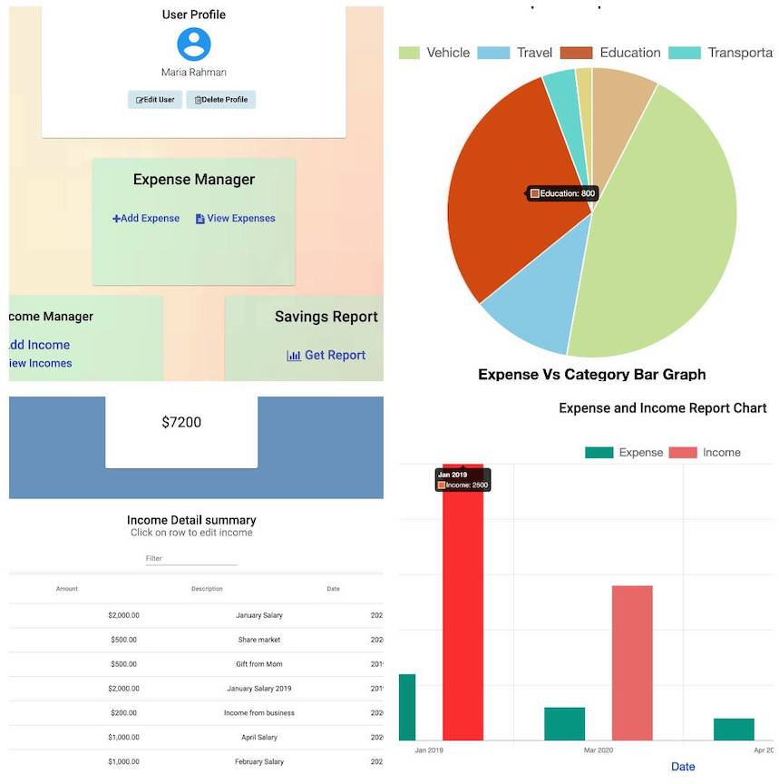
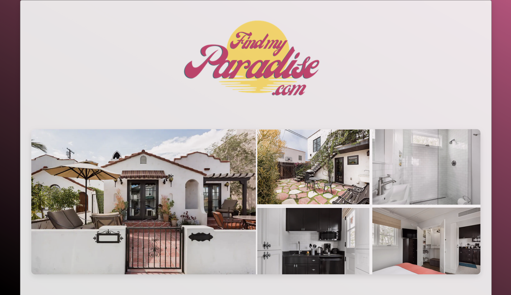
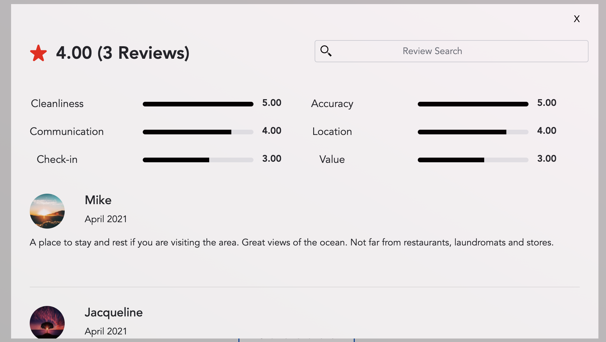
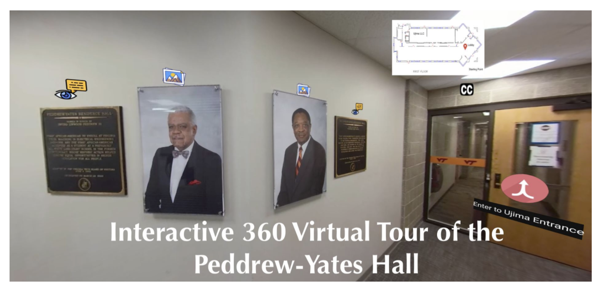

<link rel="stylesheet" type="text/css" media="all" href="./style.css" />

# Full Stack Engineer

## About Me 

### Contact Information
* **Email**
   *  <a href="mailto:yrahman@talentpath.com">`yrahman@talentpath.com`</a>
   *  <a href="mailto:yesratrahman200@gmail.com">`yesratrahman200@gmail.com`</a>
* **Website:**
    * [ https://yesratrahman.github.io/YesratRahman/]( https://yesratrahman.github.io/YesratRahman/)
* **LinkedIn:** 
    * [https://www.linkedin.com/in/yesrat-rahman-84743717a/](https://www.linkedin.com/in/yesrat-rahman-84743717a/)
* **Github:** 
    * [https://github.com/YesratRahman](https://github.com/YesratRahman)

### Education
* Virginia Tech (Dec 2020) 
   * Bachelor of Science (BS)
   * Computer Science Major, Mathematics Minor
   
### Skills and Technologies
   * **Languages:**
      * Java
      * Python 
      * C 
      * C++ 
      * HTML/CSS/Javascript/Typescript
      * ANTLR
   * **Frameworks:**
      * Angular 
      * Vue Js
      * Spring/Spring Boot 

   * **Technologies:**
      * Linux/Unix
      * GitHub
      * MATLAB
      * Jupyter Notebook
      * Latex
      * MS Office
      * Autodesk
   
  * **Database:**
      * PostgreSQL 
      * MySQL 
      * JPA/Hibernate
      * JQuery

 * **Miscellaneous:**
   * Fundamentals of OOP
   * Algorithms Patterns & Testing

### Summary
Dedicated Full Stack Engineer with hands on experience of using tools such as Spring Boot, Angular, Vue.js, JPA/Hibernate, REST, and SQL Databases. Demonstrates the capability of maintaining code by fixing bugs as well as conducting end to end testing. Highly skilled at collaborating with team members to ship beautiful products within deadline.

## Personal Projects
### [Personal Wallet](https://github.com/YesratRahman/Personal-Wallet)
#### Owner and Creator
   A full-stack web application which will help users to keep track of their daily incomes and expenses along with showcasing charts and graphs to help them            better understand their savings behavior.
 
 
  <ul> 
    <li> Spring Boot</li> 
    <li> Java</li> 
    <li> JDBC</li> 
    <li> PostgreSQL</li> 
    <li> Angular</li> 
    <li> Typescript</li> 
    <li> HTML/CSS</li> 
    <li> JUnit5</li> 
  </ul> 
  
 

 
  

 

 
 
 
 
 
 
 
 
 
### [Find My Paradise](https://github.com/Smelser-Squad/FindMyParadise)
#### Contributor
   A full stack application of a clone Airbnb listing page that allows users to view details of a listing property, reserve rental dates, view nearby                  attractions/events and see reviews of listings. 
   
 
  
  
        
  
 

 
      
  
 

 
  <ul> 
    <li> Spring Boot</li> 
    <li> Java, Maven</li> 
    <li> JPA/Hibernate</li> 
    <li> Vue.Js</li> 
    <li> AWS RDS</li> 
    <li> JUnit5</li> 
  </ul> 

  

 
 
 
 
 
 
 
 
 
 
### [Interactive 360 Virtual Tour of the Peddrew-Yates Hall](https://wordpress.cs.vt.edu/ccs2020f/2020/12/13/vt-360/)
#### Contributor
   An interactive and immersive website giving users a virtual tour to the historical building, Paddrew-Yates Hall related to Virginia Tech Black Student Community    to honor and showcase the history of the African-American community.
   

 
    <ul> 
      <li> Aframe</li> 
      <li> WebXR</li> 
      <li> Glitch</li> 
      <li> GoPro Fusion Camera, VR player, and Studio</li> 
      <li> JavaScript</li> 
      <li> HTML/CSS</li> 
    </ul> 

   
  

 
   

 

 
 
 
 
 
 
 
 
 

## Experience 
### Full Stack Engineer
#### Talent Path
##### January 2021 - Present
   * Successfully engaged in 9-weeks of work-readiness training.
   * Verified proficiency in full stack development through the use of frameworks and libraries such as Java, Spring Boot, Angular, JSON, AWS, HTML/JS, and     PostgreSQL.
   * Completed multiple business case projects by interfacing with analysts and by collaborating with an agile team. 
   * Demonstrated, within a working group, the ability to produce in a highly collaborative environment. 

## Licenses & certifications

#### Full Stack Developer
##### Talent Path (Mar 2021)
##### [See Credential](https://www.credly.com/badges/9fb9c367-a5c7-456f-9519-43442757e1ef?source=linked_in_profile)

#### Diversity and Inclusion Advocate
##### Talent Path (Jan 2021)
##### [See Credential](https://intranet1.wpengine.com/wp-content/uploads/2021/01/DI-Badges-11.2020-04.png)
